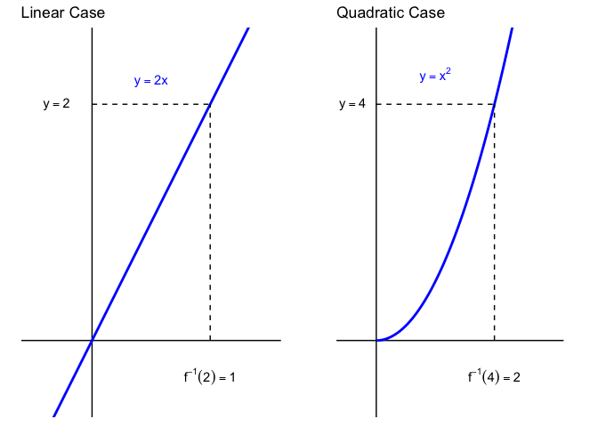
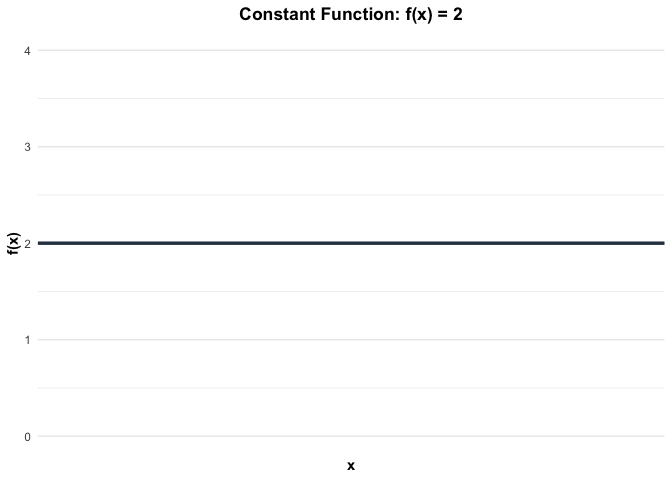
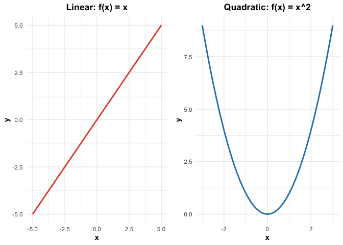
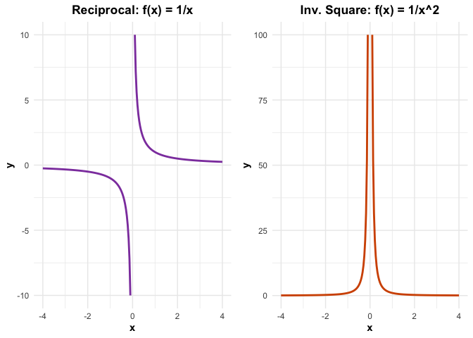
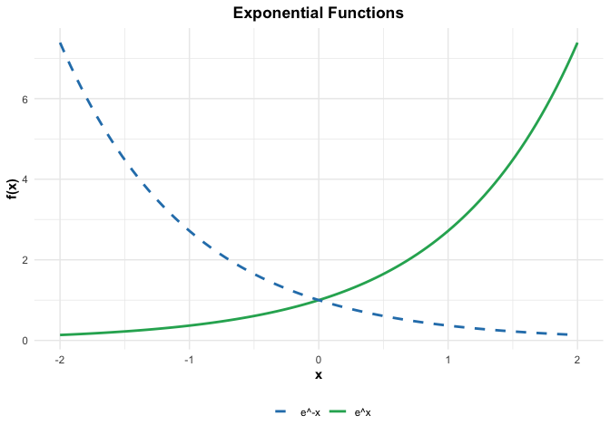
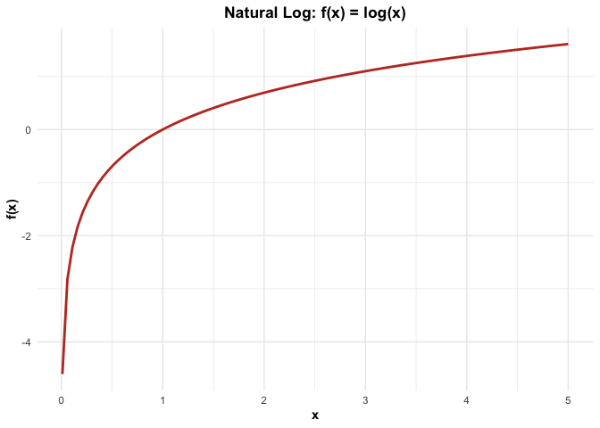
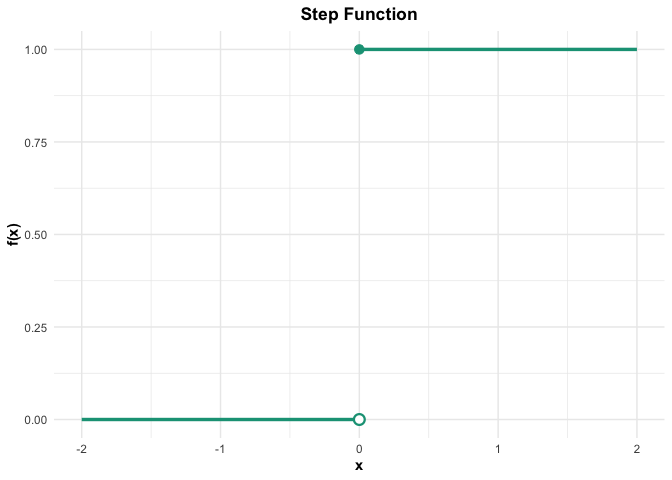
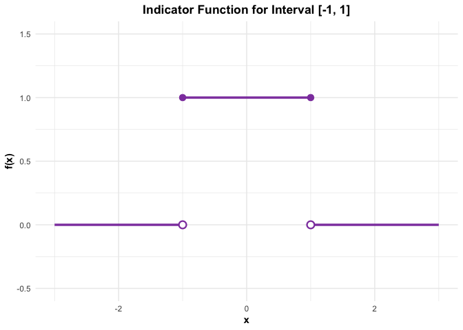

Function Basics and Common Functions
================
Jibo Shen

In this section, we review the basics of functions and list a “library”
of functions that serve as the building blocks for this course.

# Part 1: Function Basics

## Definition of a Function

At its core, a univariate function $f$ is a “rule” that assigns every
element $x$ from a set (the domain) to **exactly one** element $f(x)$ in
another set (the range).

$$y = f(x)$$

$x$ is called the input, and $y=f(x)$ is the output, or the value of the
function. Note that $x$ is just a common notation to represent the
input, and it does not actually mean anything. We can also use
$y,z,a,b,\cdots$ to represent the input. What really matters is the
relationship between the input and the output, the $f$. The same
argument goes to $y$, the notation we use to represent the output.
However, you **cannot** use the same notation for both input and output.

## The Domain vs. The Support

While sometimes used interchangeably in general calculus, the
distinction between these two is critical for this course.

The **Domain** is the set of all possible $x$ values for which the
function is mathematically defined.

e.g.) For $f(x) = \frac{1}{x}$, the domain is all real numbers except
$0$ ($x \neq 0$).

The **Support** is the set of $x$ values where the function is
**non-zero**. In probability, we often deal with functions that are
defined to be $0$ everywhere except for a specific interval.

To see the difference between the two, take a look at the function

$$ f(x) = \begin{cases} x^2 & \text{if } 0 < x < 1 \\ 0 & \text{otherwise} \end{cases} $$

Here, the domain is all real numbers $\mathbb{R}$, but the support is
$(0, 1)$. As you will see later in the review, when integrating such a
function, you must restrict your integration limits to the support.
Outside the support, the function is zero, so the integral over that
region is zero.

Note: In this course, whenever you see a function, or write down one
yourself, it is crucial that you figure out the support at first place.

## Inverse Functions

An **inverse function**, denoted as $f^{-1}(x)$, essentially acts as an
“Undo” button. If a function $f$ takes an input $x$ and gives you an
output $y$, the inverse function takes that $y$ and sends it back to
$x$. For example, if we have the forward action: $f(3) = 9$, we can do
the reverse action: $f^{-1}(9) = 3$.

The following figures visualize the concept of an inverse function,
$x = f^{-1}(y)$, where we map a known output on the vertical $y$-axis
back to its original input on the horizontal $x$-axis. The left panel
demonstrates this for a linear relationship ($f^{-1}(2)=1$), while the
right panel applies the same logic to a quadratic function
($f^{-1}(4)=2$).

Formally,

$$ f(x) = y \iff f^{-1}(y) = x $$

However, not every function has an inverse. To have an inverse, a
function must be **One-to-One**. One rule to check is that if you draw a
horizontal line anywhere on the graph and it hits the curve more than
once, then the function has *no* inverse.

e.g.) $y = x^2$ does not have an inverse because $(-2)^2$ and $2^2$ both
equal $4$, so you cannot “undo” $4$ to get a single number back.

**Important Notation Note:** $$ f^{-1}(x) \neq \frac{1}{f(x)} $$ The
$-1$ is a notation for “inverse,” not an exponent.

# Part 2: Common Functions

There are several common functions serving as the building blocks of
this course, and it is helpful to know well about them.

Functions can be classified as **continuous** and **discontinuous**. In
simple terms, a function is continuous if its graph is a single,
unbroken curve. As you will see in some of the plots below.

## Constant Function

The constant function $f(x) = c, \ x\in \mathbb{R}$ is a very special
function that no matter what the input is, the output is always a
constant.

## Power Function

Power function has the general form: $f(x) = kx^n$, where
$k\neq 0,\ n\in \mathbb{R}$. Depending on the value of the exponent $n$,
the domain and behavior of the function can be different.

When $n$ is non-negative, the domain is $\mathbb{R}$. Furthermore, when
$n$ is a non-negative integer ($0,1,2,,3,\cdots$), the function is also
called the polynomial function. e.g.) Linear function, $f(x) = x$ and
Quadratic function, $f(x) = x^2$.

When $n$ is negative, the domain is $x\neq0$, as we are dealing with
fractions, and $0$ can not show up in denominator. e.g.)
$f(x) = \frac{1}{x}$ and $f(x) = \frac{1}{x^2}$

## Exponential Function

The exponential function has the standard form:
$f(x) = a \cdot b^x,\ x\in \mathbb{R}$, where $a\neq0,\ b>0,\  b\neq1$.
The constant $b$ is called the **base**

In this course, you will mostly deal with the exponential function with
base $e$, the **Euler’s Number**. The function under this base has the
form $f(x) = a \cdot e^{kx}$, where the constant $k$ controls the growth
rate.

e.g.) $f(x) = e^x$ or $f(x) = e^{-x}$

## The Logarithmic Function

The logarithmic function has the general form, or the general Logarithm
($f(x)=\log_b x$), where **base $b$** must be positive and not equal to
$1$, and **domain** defined strictly for $x > 0$. You cannot take the
log of zero or a negative number.

Again, in this course, you will mostly deal with the logarithmic
function with base $e$, the **Natural Log**: $f(x)=\log x$.

Note: The natural log can also be denoted by $f(x)=\ln x$. In this
course, we stick with the notation $f(x)=\log x$ for the natural log.

*The following two functions are cases of discontinuous functions:*

## Step (Piecewise) Functions

A step function is defined by different formulas on different intervals
of its domain.

e.g.)
$$ f(x) = \begin{cases} 0 & \text{if } x < 0 \\ 1 & \text{if } x \ge 0 \end{cases} $$

Note that we put a hollow point at $(0,0)$ and a filled point at
$(0,1)$.

## The Indicator Function

Take a look at the function $f(x)$ as shown in the graph below.

The function returns 1 if $x\in [-1,1]$, and $0$ otherwise. It is an
example of the indicator function, a specific type of step function used
as a logical “switch.”

The indicator function has a specific notation $I_A(x)$. The utility of
the function is that it returns 1 if $x$ satisfies a specific condition
(is inside set $A$), and $0$ otherwise. It effectively “turns off” a
function outside of a specific region.

$$I_A(x) = \begin{cases} 1 & \text{if } x \in A \\ 0 & \text{if } x \notin A \end{cases} $$
