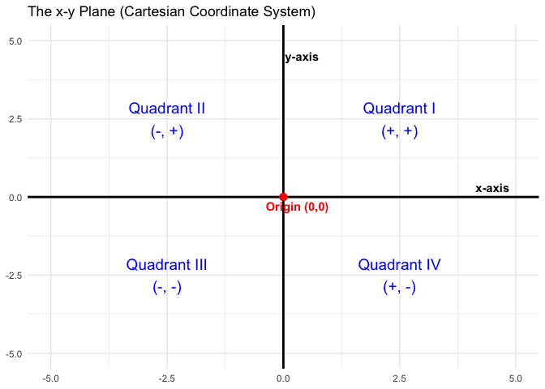
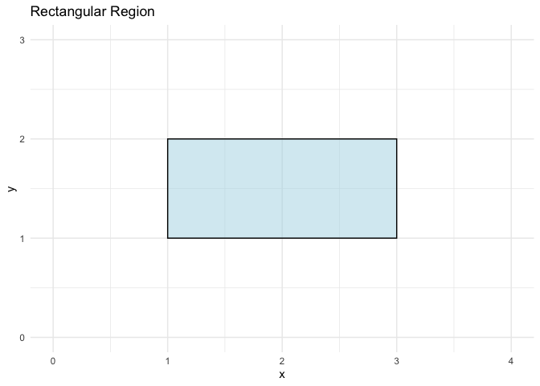
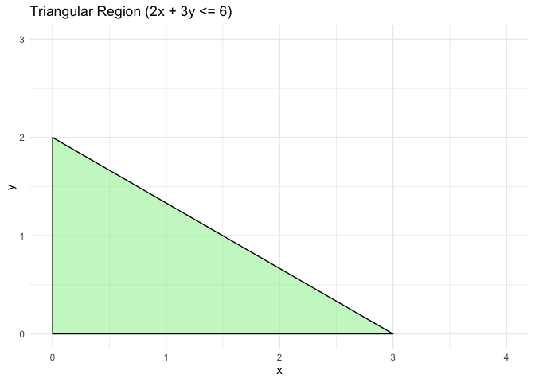
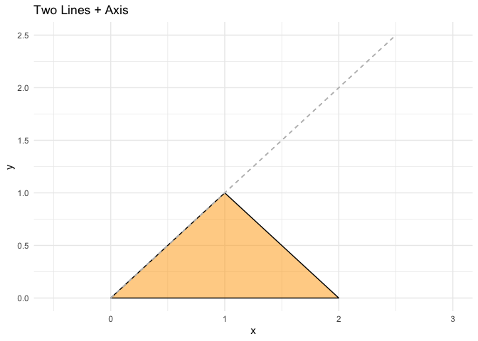
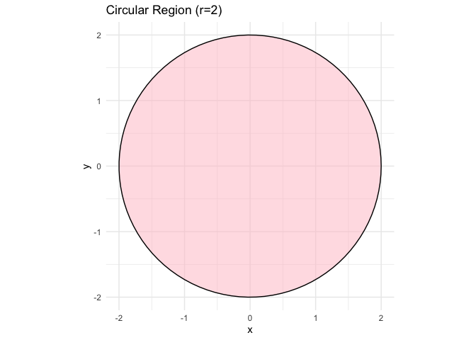

Activity: Graphing Regions on x-y Plane
================
Jibo Shen

Visualizing the region where a function is defined is a critical skill.
This activity reviews how to sketch common regions defined by
inequalities on the $x$-$y$ plane.

------------------------------------------------------------------------

### Introduction to the $x$-$y$ Plane (The Cartesian Plane)

The $x$-$y$ plane is a two-dimensional flat surface formed by the
intersection of two perpendicular number lines. It allows us to pinpoint
the exact location of any point or shape using a pair of numbers.

Here are the key components:

- **The $x$-axis:** The horizontal number line. Moving to the right from
  the center gives positive values, and moving to the left gives
  negative values.
- **The $y$-axis:** The vertical number line. Moving up from the center
  gives positive values, and moving down gives negative values.
- **The Origin:** The exact center of the plane where the $x$-axis and
  $y$-axis intersect. It represents the starting point for measuring and
  has the coordinates $(0,0)$.
- **Coordinates $(x, y)$:** Every point on the plane is defined by an
  ordered pair. The first number ($x$) tells you how far to move
  horizontally along the $x$-axis, and the second number ($y$) tells you
  how far to move vertically parallel to the $y$-axis.
- **The Four Quadrants:** The two intersecting axes divide the plane
  into four distinct sections, called quadrants. They are numbered
  counterclockwise using Roman numerals, starting from the top right:
  - Quadrant I: Both $x$ and $y$ are positive ($x > 0, y > 0$).
  - Quadrant II: $x$ is negative, $y$ is positive ($x < 0, y > 0$).
  - Quadrant III: Both $x$ and $y$ are negative ($x < 0, y < 0$).
  - Quadrant IV: $x$ is positive, $y$ is negative ($x > 0, y < 0$).

### What is a Region?

On the $x$-$y$ plane, an equation with an equals sign (like $y = 2x$ or
$x^2 + y^2 = 4$) describes a specific boundary—a 1D line or curve.

A **region** is a two-dimensional area on the plane. It consists of a
collection of points $(x,y)$ that satisfy an **inequality** (like $<$,
$>$, $\le$, or $\ge$). For example, $y \le x$ is the entire area of the
plane that falls exactly on or anywhere below that line.

When you are asked to graph a region, you are essentially looking for
the overlapping area where all the given conditions (inequalities) are
true at the same time, and then you shade that area in.

------------------------------------------------------------------------

### Rectangular Regions

Inequalities: $a \le x \le b$ and $c \le y \le d$

**How to Sketch:**

1.  Vertical Bounds: Draw vertical lines passing through $x = a$ and
    $x = b$.
2.  Horizontal Bounds: Draw horizontal lines passing through $y = c$ and
    $y = d$.
3.  Region: The rectangle is the overlapping area trapped between these
    four lines.

Example: Sketch the region where $1 \le x \le 3$ and $1 \le y \le 2$.

- Vertices: $(1,1), (3,1), (3,2), (1,2)$.

------------------------------------------------------------------------

### Triangles (Bounded by Axes)

Inequalities: $Ax + By \le C$ (with $x \ge 0, y \ge 0$)

**Key Concept:**

The equation $Ax + By = C$ represents a straight line. This line acts as
a boundary that **splits the entire $x$-$y$ plane into two separate
regions**: 1. One side where $Ax + By < C$. 2. The other side where
$Ax + By > C$. To graph the inequality, you simply need to draw the line
and determine which “half” of the plane you are in.

**How to Sketch:**

1.  Find Intercepts: Treat the inequality as a line equation
    ($Ax + By = C$).
    - Set $y = 0$ to find the $x$-intercept.
    - Set $x = 0$ to find the $y$-intercept.
2.  Draw the Line: Plot these two intercepts on the axes and connect
    them with a straight line.
3.  Determine the Region: An easy way to do so is picking a point on the
    plane to test.
    - Pick a random point **not** on the line to test. $(0,0)$ is
      usually the easiest choice.
    - Plug $(0,0)$ into the inequality: Is $A(0) + B(0) < C$?
    - If **YES** ($0 < C$), then the region *contains* the origin (shade
      the side with $(0,0)$).
    - If **NO**, then the region is on the *other* side of the line.
    - If $(0,0)$ is on the line, simply pick another point that is easy
      to evaluate.

Example: Sketch the region $2x + 3y \le 6$ in the first quadrant
($x,y \ge 0$).

- Intercepts:
  - $x$-intercept: $2x=6 \implies x=3$. Point $(3,0)$.
  - $y$-intercept: $3y=6 \implies y=2$. Point $(0,2)$.
- Test Point $(0,0)$:
  - Check: $2(0) + 3(0) = 0$.
  - Is $0 < 6$? **Yes.**
  - Therefore, we shade the region *towards* the origin.

------------------------------------------------------------------------

### Triangles (Bounded by Two Lines + Axis)

Inequalities: $y \le L_1(x)$, $y \le L_2(x)$, and $y \ge 0$.

**How to Sketch:**

1.  Find the Peak (Intersection): Set the two line equations equal to
    each other ($L_1(x) = L_2(x)$) to find where they intersect.
2.  Find the Base: Find where each line crosses the horizontal axis.
3.  Region: Connect the intersection point to the two base points.

Example: Sketch the region bounded by $y = x$, $y = 2 - x$, and $y = 0$.

- Intersection: $x = 2 - x \implies 2x = 2 \implies x = 1$. Peak at
  $(1, 1)$.
- Base:
  - $y=x$ meets $y=0$ at $(0,0)$.
  - $y=2-x$ meets $y=0$ at $(2,0)$.

------------------------------------------------------------------------

### Circular Regions

Inequality: $(x - h)^2 + (y - k)^2 \le r^2$

**How to Sketch:**

1.  Identify Center: The center is $(h, k)$.
2.  Identify Radius: The radius is $r$ (take the square root of the
    right hand side of the inequality).
3.  Test Point: Just like lines, you can test $(h,k)$. If the center
    satisfies the inequality (it usually does for $\le$), shade inside.

Example: Sketch the region $x^2 + y^2 \le 4$.

- Center: $(0,0)$.
- Radius: $\sqrt{4} = 2$.
- Test Point: Is $0^2 + 0^2 \le 4$? Yes, so shade inside.

------------------------------------------------------------------------

### Practice

Now try to make some plots yourself! Sketch the following regions on an
$x$-$y$ plane:

1.  Sketch the region defined by $0 \le x \le 2$ and $2 \le y \le 4$.

2.  Sketch the region defined by $x + y \le 3$, restricted to the first
    quadrant ($x \ge 0, y \ge 0$). Label the vertices.

3.  Sketch the region defined by $2x + y \le 4$, restricted to the first
    quadrant ($x \ge 0, y \ge 0$). Label the vertices.

4.  Sketch the region bounded by $y = x$, $y = 6 - 2x$, and the x-axis
    ($y = 0$).

5.  Sketch the region bounded by $y = 2x$, $y = 8 - 2x$, and the x-axis
    ($y = 0$).

6.  Sketch the region defined by $x^2 + y^2 \le 9$.

7.  Sketch the region defined by $(x - 1)^2 + y^2 \le 1$.
