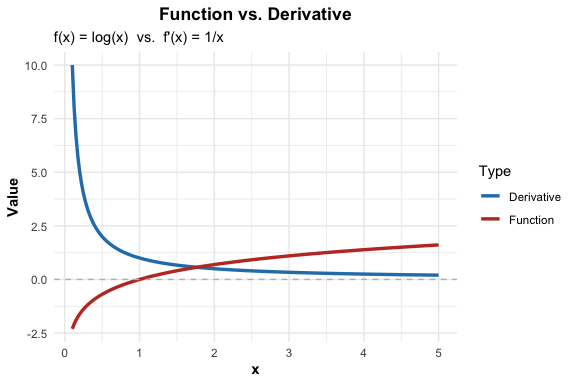
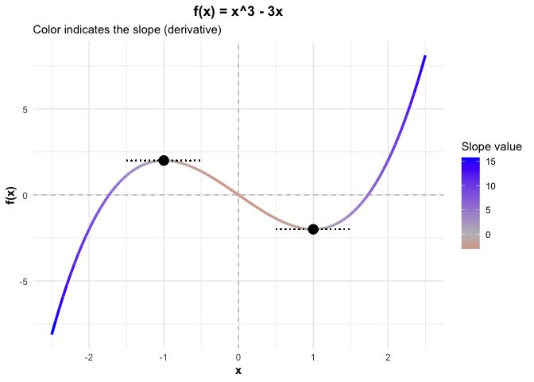

Differentiation Basics
================
Jibo Shen

In this section, we review some differentiation basics. Differentiation
is a fundamental tool in calculus. It is used to determine the
instantaneous rate of change of a function. To put it simple, by
inspecting the differentiation of a function, we can have a sense of how
fast the function changes.

There are several notation systems for differentiation. In this course,
we often use the following notation, which explicitly treats
differentiation as an action applied to a function.

$$ \frac{d}{dx} \Big[ f(x) \Big] $$

You can read this as: “The derivative **with respect to x** … of
$f(x)$.”

Note: The term “with respect to x” emphasizes the essential fact that
$x$ is the variable changing, while all other letters are treated as
constants.

You can also read in short the notation as: “d - d x … of $f(x)$.”

Another convenient notation is to write the differentiation of $f(x)$ as
$f'(x)$.

------------------------------------------------------------------------

## Part 1: Derivatives of Simple Functions

Here are the derivative of some simple function:

### The Constant Function

If $f(x) = c$, then the derivative is zero.

$$
\frac{d}{dx} c = 0
$$

### The Power function

For any real number $n$, the power function $f(x)=x^n$ has derivative:

$$
\frac{d}{dx} x^n = n x^{n-1}
$$

e.g.) $\frac{d}{dx} x^3 = 3x^{(3-1)}=3x^2$,
$\frac{d}{dx} \frac{1}{x} = \frac{d}{dx} x^{-1} = (-1)x^{-1-1} = -\frac{1}{x^2}$

Note: Even though a power function has different behaviors depending on
the value of $n$, the formula of derivative is the same.

### The Exponential Function

The Natural Exponential $f(x)=e^x$: The natural exponential function is
very unique because it is its own derivative.

$$
\frac{d}{dx} e^x = e^x
$$

The General Exponential $f(x)=a^x$: For any base $a > 0$ ($a \neq 1$):

$$
\frac{d}{dx} a^x = a^x \log(a)
$$

### The Logarithmic Function

The derivative of the natural logarithm $f(x)=\log x$ is the reciprocal
function.

$$
\frac{d}{dx} \log(x) = \frac{1}{x}
$$

For the general logarithm $f(x)=\frac{d}{dx} [\log_b(x)]$,

$$
\frac{d}{dx} [\log_b(x)] = \frac{1}{x \log(b)}
$$

### Trigonometric Functions

The derivatives of sine function $f(x)=\sin x$ and cosine function
$f(x)=\cos x$ are cyclical.

$$
\frac{d}{dx} \sin(x) = \cos(x)
$$ $$
\frac{d}{dx} \cos(x) = -\sin(x)
$$

Note: Don’t forget the negative sign when differentiating cosine!

## Part 2: Basic Properties

Differentiation is a linear operator, meaning it follows two predictable
rules when dealing with sums and constants.

### Function multiplied by a constant

If you multiply a function by a constant $c$, the derivative is just
multiplied by that same constant.

$$
\frac{d}{dx}[c \cdot f(x)] = c \cdot \frac{d}{dx}f(x)
$$

### Sum of two functions

The derivative of a sum is the sum of the derivatives.

$$
\frac{d}{dx}[f(x) + g(x)] = \frac{d}{dx}f(x) + \frac{d}{dx}g(x)
$$

e.g.) To differentiate $f(x) = x^2 + e^x$, you differentiate $x^2$ and
$e^x$ separately, then add the results. You can also see that
$\frac{d}{dx}[f(x) + c]=\frac{d}{dx}f(x)$.

Note: When doing differentiation, it is important to always keep in mind
what is the changing variable, and what are the constants.

## Visualization of Derivatives

Visualizing a function alongside its derivative helps build intuition.
Below, we look at the Natural Log function $f(x)=\log x$ (Red) and its
derivative, $f(x)=1/x$ (Blue).

Notice that as the slope of the Red curve gets flatter (as $x$
increases), the value of the Blue curve gets closer to $0$.

Let’s look at another function $f(x) = x^3 - 3x$. In the plot, the
function is colored by the slope (derivative) at each point. Note that
the derivative is positive when $x<-1$ or $x>1$, is negative when
$-1< x < 1$, and is zero at the point $x=-1$ and $x=1$.

