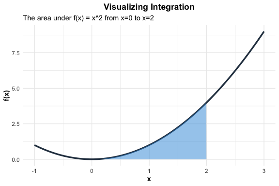

Integration Basics
================
Jibo Shen

In this section, we review some integration basics. Integration is
fundamentally the reverse process of differentiation. While
differentiation finds the rate of change, integration sums up small
quantities to find a total.

## Integration Basics

### Definite Integral

The definite integral calculates the accumulated value between two
points $a$ and $b$. The result is a **number**.

$$
\int_a^b f(x) \, dx
$$

- $dx$ tells you which variable you are integrating. It also implies
  that everything else is considered as constants.
- $a$ and $b$ are the lower and upper limit of integration.

Integration has a geometric interpretation: The definite integral
$\int_a^b f(x) \, dx$ represents the signed area between the curve
$f(x)$ and the x-axis from $x=a$ to $x=b$.

e.g.) The shaded area below corresponds to the definite integral
$\int_0^2 x^2 \, dx$.

### Variable Limits

The limit of the integral can also be a variable. When the limit of
integration is a variable, the integral defines a new function

$$
F(x)=\int_a^x f(t) \, dt.
$$

$F(x)$ represents the accumulated area under the curve $f(t)$ from a
fixed starting point $a$ up to a moving endpoint $x$. Note that we
switch the variable inside the integral to a “dummy variable” $t$ to
avoid confusing it with the limit $x$.

We can also differentiate $F(x)$:

**The Basic Rule:** The derivative of the integral recovers the original
function.

$$ \frac{d}{dx} \int_a^x f(t) \, dt = f(x) $$

The limit of the integral can even be a function $g(x)$. To
differentiate it, we apply the chain rule:

$$ \frac{d}{dx} \int_a^{g(x)} f(t) \, dt = f(g(x)) \cdot g'(x) $$

Note: Try to verify this result yourself. It can help with the
understanding of chain rule.

### The Indefinite Integral

An indefinite integral represents the general “antiderivative” of a
function. It essentially asks the question: “Which function $F(x)$, when
differentiated, gives me $f(x)$?”

$$ \int f(x) \, dx = F(x) + C $$

- $F(x)$: The “antiderivative” function.
- $C$: The Constant of Integration.

We need the $+C$ because the derivative of any constant is zero, and
there are infinitely many functions that could be the answer (e.g.,
$x^2$, $x^2 + 5$, $x^2 - 100$ all differentiate to $2x$). We represent
this entire “family of functions” by adding an arbitrary constant $C$.

- Note that an indefinite integral returns a **function**, whereas a
  definite integral returns a **number**.

### Calculating Definite Integrals

To solve a definite integral, we use the **Fundamental Theorem of
Calculus**. This theorem links the area under a curve to the
antiderivative.

If $F(x)$ is the antiderivative of $f(x)$, then:

$$ \int_a^b f(x) \, dx = F(b) - F(a) $$

To calculate a definite integral, there are essentially three steps:

1.  Integrate: Find the indefinite integral $F(x)$ (you can ignore the
    $+C$).
2.  Evaluate: Plug in the upper limit $b$ and the lower limit $a$.
3.  Subtract: Calculate Top minus Bottom.

**Notation**: We often use a vertical bar or bracket to denote the
evaluation step:

$$ \left[ F(x) \right]_a^b = F(b) - F(a) $$

e.g.)

$$ \int_0^3 x^2 \, dx = \left[ \frac{x^3}{3} \right]_0^3 = \frac{3^3}{3} - \frac{0^3}{3} = 9 - 0 = 9 $$

------------------------------------------------------------------------

## Integrals of Simple Functions

It is helpful to memorize well the indefinite integrals of some common
functions.

### The Constant Function

$$
\int c \, dx = cx + C
$$

### The Power Function

This is the reverse of the derivative power rule. Instead of multiplying
and subtracting, you add and divide.

$$
\int x^n \, dx = \frac{x^{n+1}}{n+1} + C
$$

**Note:** This rule applies for all $n \neq -1$.

### The Reciprocal Function

When $n = -1$, the power rule fails. This is the special case that
yields the natural logarithm.

$$
\int \frac{1}{x} \, dx = \log|x| + C
$$

### The Exponential Function

The Natural Exponential $e^x$

$$
\int e^x \, dx = e^x + C
$$

- With a constant coefficient $e^{kx}$: $$
    \int e^{kx} \, dx = \frac{1}{k}e^{kx} + C
    $$

The General Exponential $a^x$

$$
\int a^x \, dx = \frac{a^x}{\log(a)} + C
$$

### Trigonometric Functions

$$
\int \sin(x) \, dx = -\cos(x) + C
$$ $$
\int \cos(x) \, dx = \sin(x) + C
$$

Be careful with the signs!

------------------------------------------------------------------------

## Basic Properties

Like differentiation, integration is a linear operator, meaning it also
handles constants and sums predictably.

### Function multiplied by constants

You can pull constants outside the integral sign.

$$
\int c \cdot f(x) \, dx = c \cdot \int f(x) \, dx
$$

Again, it is crucial to always keep in mind what is the variable and
what are the constants. It is a useful practice to first pull all the
constants outside of the integral before calculation.

### Sum of functions

The integral of a sum is the sum of the integrals.

$$
\int [f(x) + g(x)] \, dx = \int f(x) \, dx + \int g(x) \, dx
$$

Note: There is **no** simple “Product Rule” or “Quotient Rule” for
integrals. Products usually require *Integration by Parts*, which we
will cover in the next section.
