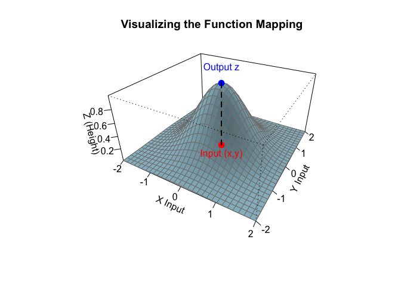
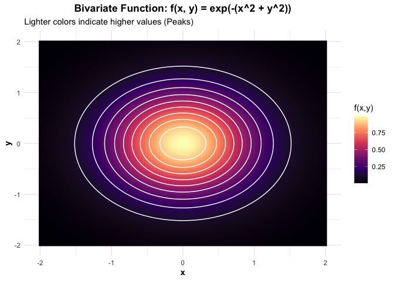

Bivariate function basics
================
Jibo Shen

# Definition of a Bivariate Function

So far, we have dealt with univariate functions where a single input $x$
determines an output $y$. A **bivariate function** $f$ is a rule that
assigns an ordered pair of real numbers $(x, y)$ from a set (the domain)
to a single real number $z$.

$$z = f(x, y)$$

e.g.) $f(x, y) = x^2 + y^2$. If inputs are $x=1, y=2$, the output is
$z = f(1, 2) = 1^2 + 2^2 = 5$.

Here, the input is a **point** on a plane $(x, y)$, and the output $z$
represents the “height” of the function at that point. See the plot
below to get a sense of how the mapping works.

Note that $x, y, z$ are just common notations. We can use any letters
(like $u, v, w$ or $s, t$) to represent the inputs and output. What
matters is the relationship, not the specific letter. However, you can
**not** use the same letter twice (e.g., you cannot say $y = f(x, y)$ or
$x = f(x, y)$) because a variable cannot represent both an input and the
output simultaneously.

# Domain vs. Support (2D)

Just like in the univariate case, distinguishing between domain and
support is critical, especially for calculating double integrals later.

The **Domain** is the set of all pairs $(x, y)$ for which the
mathematical formula is valid.

The **Support** is the specific region in the $xy$-plane where the
function is **non-zero**. We often deal with functions that are defined
to be $0$ everywhere except for a specific region (like a rectangle or
triangle).

e.g.) Consider the function:

$$f(x, y) = \begin{cases} 4xy & \text{if } 0 < x < 1 \text{ and } 0 < y < 1 \\ 0 & \text{otherwise} \end{cases}$$

Here, the domain is $\mathbb{R}^2$ (the entire 2D plane), but the
support is the unit square $[0, 1] \times [0, 1]$. Just as univariate
integral, when integrating such a function, you must restrict your
integration limits to the support. Outside the support, the function is
zero, so the integral over that region is zero.

# Visualizing Bivariate Functions

Visualizing functions of two variables is harder because we need three
dimensions: $x$ (width), $y$ (depth), and $z$ (height).

## Contour Plots

While we can draw 3D surfaces, it is often more precise to use a
**Contour Plot**. It looks like a mountain on a map. A contour line
connects all points $(x, y)$ that have the same height $z$. If lines are
close together, the function is changing steeply. If they are far apart,
the function is flat.

## Example: The Bell Surface

A classic example is the “Bell Hill” shape, defined by the function:

$$f(x, y) = e^{-(x^2 + y^2)}$$

In the plot, the brightest spot in the center is the peak (maximum) of
the function at $(0,0)$. The white rings are the contour lines, and
along any single ring, the function value is constant.

# Slices

A useful way to understand a bivariate function is to freeze one
variable and look at what happens to the other. This is the intuition
behind **Partial Derivatives**, which we will discuss in the next
section.

For the above function $f(x,y)= e^{-(x^2 + y^2)}$, if we fix $y = 0$, it
becomes univariate:

$$f(x, 0) = e^{-(x^2 + 0)} = e^{-x^2}$$ This describes the “profile” of
the hill if you slice it right down the middle along the x-axis.

# Separable Functions

A special class of bivariate functions arises when the function can be
factored into two separate univariate functions multiplied together.

$$f(x, y) = g(x) \cdot h(y)$$

This structure makes integration much easier, as we can separate the
problem into two smaller problems.

e.g.) $f(x, y) = e^{-x} e^{-y} = e^{-(x+y)}$. This is separable because
we can cleanly split the $x$ terms and $y$ terms.

e.g.) $f(x, y) = x + y$. This is **not** separable; you cannot write it
as (only x stuff) $\times$ (only y stuff).
