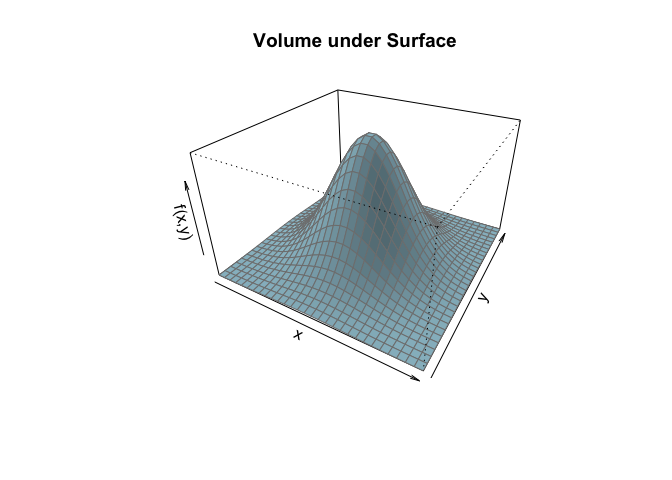
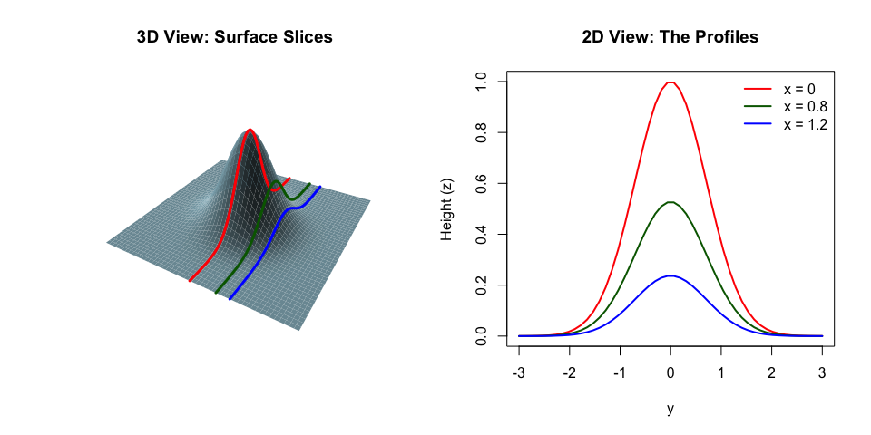
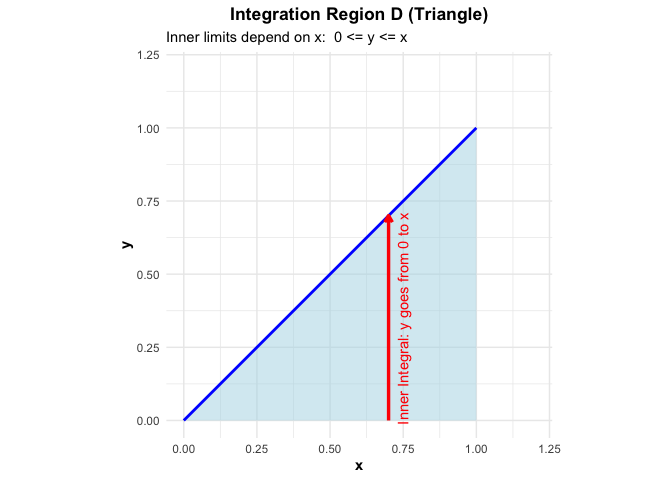

Bivariate Integration (Double Integrals)
================
Jibo Shen

In this section, we extend the concept of integration to functions of
two variables. Just as the single integral sums up areas to find a
total, the double integral sums up volumes.

------------------------------------------------------------------------

### The Definite Double Integral

The double integral calculates the accumulated value over a 2D region
$D$ in the $xy$-plane. The result is a **number**.

$$
\iint_D f(x, y) \, dx \, dy
$$

- $D$: The region of integration.
- $dx \, dy$: Represents a tiny rectangular piece of area.

**Geometric Interpretation:** While the single integral $\int f(x)dx$
represents the area under a curve, the double integral
$\iint f(x, y) dx dy$ represents the **Volume** under the surface
$z = f(x, y)$ and above the region $D$.

e.g.) The volume under the surface $f(x,y) = e^{-(x^2+y^2)}$ over the
square region $[-2, 2] \times [-2, 2]$.

------------------------------------------------------------------------

## Calculating Double Integrals

While it is sometimes possible to calculate a double integral directly
using geometry: for instance, integrating a constant function $f(x,y)=c$
over a circular region defined by $x$ and $y$ is simply the area of the
circle multiplied by the height $c$.

**Example:**

Let $D$ be the region defined by $x^2 + y^2 \le 9$. Evaluate:

$$
\iint_D 4 \, dx \, dy
$$

Since the integrand is a constant ($f(x,y) = 4$), we can pull it out of
the integral:

$$
\iint_D 4 \, dx \, dy = 4 \iint_D 1 \, dx \, dy
$$

The remaining integral $\iint_D 1 \, dx \, dy$ represents the **area**
of the region $D$. Since $D$ is a circle with radius $r=3$, its area is
$\pi (3)^2 = 9\pi$.

$$
\text{Answer} = 4 \times 9\pi = 36\pi
$$

However, this approach is rare in practice. In the general case, where
the function $f(x,y)$ varies across the region and the domain $D$ has a
complex shape, we cannot rely on simple geometric formulas. Instead, we
must use a technique called **Iterated Integration**, which allows us to
break the complex double integral down into a sequence of two manageable
univariate integrals.

### The Logic of “Slicing”

The key insight is to **fix one variable** and treat it as a constant.
This reduces the problem to a dimension we already know how to handle.

**Step 1: The Inner Integral (The Slice)**

Imagine we want to integrate $f(x, y)$ over a region. First, we pick one
variable to integrate, say $y$, while holding $x$ **fixed**.

When $x$ is fixed, the function $f(x, y)$ behaves just like a
single-variable function of $y$. We calculate the integral with respect
to $y$:

$$
A(x) = \int_{c}^{d} f(x, y) \, dy
$$

**Note:** The result of this inner integral, $A(x)$, is not a single
number. It is a **function of $x$**. Geometrically, $A(x)$ represents
the *cross-sectional area* at that specific $x$-value.

**Step 2: The Outer Integral (The Volume)**

Now that we have a function $A(x)$ representing the area of every slice,
we simply add up all these areas by integrating with respect to the
remaining variable, $x$:

$$
\text{Total Volume} = \int_{a}^{b} A(x) \, dx = \int_{a}^{b} \left[ \int_{c}^{d} f(x, y) \, dy \right] \, dx
$$

### Separable Functions

In calculus, we say a function is **separable** if it can be written as
a product of two single-variable functions (a function of $x$ times a
function of $y$):

$$
f(x, y) = g(x) \cdot h(y)
$$

It is a very special case that sometimes appears in this course.

**What does this mean for Slicing?**

If we apply our “slicing” logic to a separable function, something
special happens. Let’s integrate with respect to $y$ while holding $x$
fixed:

$$
\text{Inner Integral} = \int_{c}^{d} g(x) \cdot h(y) \, dy
$$

Because $x$ is fixed, the term $g(x)$ is treated as a **constant
coefficient**. We can pull it completely outside the integral:

$$
\text{Inner Integral} = g(x) \cdot \left[ \int_{c}^{d} h(y) \, dy \right]
$$

Geometrically, this implies that **every slice looks the same**.

- If you slice the surface at $x = 1$, the profile is the curve $h(y)$
  scaled by the value $g(1)$.
- If you slice at $x = 2$, the profile is the exact same curve $h(y)$,
  just scaled by a different factor $g(2)$.
- The value of $x$ does not change the *relative shape* of the function
  with respect to $y$.

This means the “shape” of the function with respect to $y$ does not
change as we move along the $x$-axis. The profile might get taller or
shorter, but its fundamental features remain identical. In this sense,
the behavior of $y$ is somewhat “independent” of $x$. The value of $x$
acts only as a volume knob (scaling factor), not a tuner (changing the
shape).

To understand what “separability” looks like, let’s examine the
function:

$$
f(x, y) = e^{-(x^2 + y^2)}
$$

**Why is this function separable?** Using the rules of exponents, we can
split the term in the exponent:

$$
e^{-(x^2 + y^2)} = e^{-x^2 - y^2} = e^{-x^2} \cdot e^{-y^2}
$$

If we define $g(x) = e^{-x^2}$ and $h(y) = e^{-y^2}$, we see clearly
that:

$$
f(x, y) = g(x) \cdot h(y)
$$

Because the function factors perfectly into a part depending only on $x$
and a part depending only on $y$, it is separable.

**Visualizing the “Slices”**

Below is a plot of this function, slicing it at fixed values of $x$
($x=0$, $x=0.8$, $x=1.2$).

- Left Plot (3D View): This shows the surface of the function. The
  colored lines represent the “cuts” we made at specific, fixed values
  of $x$. Notice how we are freezing $x$ and only looking at how the
  function behaves along $y$.

- Right Plot (2D View): This shows the profile of those cuts flattened
  onto a 2D graph.

  - Look closely at the shapes of the curves (Red, Green, Blue). They
    are all “bell curves.”
  - The shape of the curve never changes. The Green curve is not wider
    or narrower than the Red curve; it is simply shorter.
  - This visualizes the fact that $x$ and $y$ are acting independently.
    Changing the value of $x$ scales the function up or down, but it
    does not distort the fundamental behavior of $y$.

------------------------------------------------------------------------

In general, there are two types of strategies, depending on the integral
region.

### Rectangular Regions (Constant Limits)

The simplest case is when the region $D$ is a rectangle defined by
constants ($a \le x \le b$ and $c \le y \le d$).

$$
\int_c^d \left[ \int_a^b f(x, y) \, dx \right] dy
$$

To do this, we just need to do two univariate integral over constant
limits.

**Inner Integral:** Integrate with respect to the inner variable (e.g.,
$x$) first, over its lower and upper limit ($a$ and $b$). Crucially,
treat the outer variable ($y$) as a **constant**.

**Outer Integral:** Take the result, which is now a function of only
$y$, and integrate it with respect to the outer variable $y$.

Note that you can **swap the order** if the limits are constants:
Fubini’s Theorem ensures that you can swap the order of integration
without changing the result. This is often useful if one order is easier
to calculate than the other.

$$
\int_c^d \int_a^b f(x, y) \, dx \, dy = \int_a^b \int_c^d f(x, y) \, dy \, dx
$$

**Example:**

Let $D$ be the rectangular region defined by $0 \le x \le 2$ and
$0 \le y \le 1$. Evaluate:

$$
\iint_D (x + y) \, dy \, dx
$$

We integrate over $x$ first.

1.  Inner ($dx$): Integrate $x + y$ from $0$ to $2$, treating $y$ as
    constant.
    $$\int_0^2 (x+y) dx = \left[ \frac{1}{2}x^2 + xy \right]_{x=0}^{x=2} = (\frac{1}{2}(2)^2 + 2y) - (0) = 2 + 2y$$
2.  Outer ($dy$): Integrate the result $2 + 2y$ from $0$ to $1$.
    $$\int_0^1 (2 + 2y) \, dy = \left[ 2y + y^2 \right]_0^1 = (2(1) + 1^2) - 0 = 3$$

**Separable Functions**

Recall the separable functions mentioned above. For this type of
functions, provided the limits are constants, the double integral splits
into the product of two single integrals:

$$
\iint f(x, y) \, dx \, dy = \left( \int g(x) \, dx \right) \cdot \left( \int h(y) \, dy \right)
$$

**Example:**

Let $D$ be the region defined by $0 \le x \le 1$ and $0 \le y \le 1$.
Evaluate:

$$
\iint_D x e^y \, dx \, dy
$$

Since $x e^y$ separates into $g(x)=x$ and $h(y)=e^y$:

$$
\iint_D x e^y \, dx \, dy= \left( \int_0^1 x \, dx \right) \cdot \left( \int_0^1 e^y \, dy \right)
= \left[ \frac{1}{2} \right] \cdot \left[ e - 1 \right] = \frac{e-1}{2}
$$

### General Regions

When the region $D$ is not a rectangle (like a triangle or circle), the
limits of the inner integral will be **functions**, not constants.

To split this into two univariate integrals, we must decide what is the
outer integral, and what is the inner integral. Then we need to decide
the outer and inner limit.

1.  **Outer Limit ($x$):** From where to where does the region exist on
    the x-axis? Note the outer limit must be **constants**. If your
    outer limit is a function of the other variable, something must be
    wrong.
2.  **Inner Limit ($y$):** For a specific, fixed $x$, what is the bottom
    $y$ boundary and top $y$ boundary?

It is often very helpful to visualize the region. See the example below.

**Example: Integrating over a Triangle**

Let $D$ be the triangular region defined by $0 \le x \le 1$ and
$0 \le y \le x$. Evaluate:

$$
\iint_D 2xy \, dy \, dx
$$

First plot out the integration domain $D$ (the blue area). Note that the
blue line stands for $y=x$. We choose $x$ to be the outer integral, and
$y$ to be the inner integral. We can see that the limit for $x$ is $0$
to $1$. Given $x$, imagine scanning the region with vertical lines, we
can see that $y$ goes from $0$ to $x$.

**Calculation:**

$$
\int_0^1 \left[ \int_0^x 2xy \, dy \right] \, dx
$$

Inner ($dy$): Treat $x$ as constant. Limits are $0$ to $x$.
$$\int_0^x 2xy \, dy=\left[ x y^2 \right]_{y=0}^{y=x} = x(x)^2 - x(0)^2 = x^3$$
Outer ($dx$): Integrate the result $x^3$ from 0 to 1.
$$\int_0^1 x^3 \, dx = \left[ \frac{1}{4}x^4 \right]_0^1 = \frac{1}{4}$$

**Note:** Unlike the rectangular case, you cannot simply swap the order
here. If you wanted to integrate $dx$ first, you would need to redraw
the horizontal slices and redefine the limits (where $x$ would go from
$y$ to $1$). Try it as an exercise. Doing this in the reverse order
yields the same answer.

**Caution!** Just as calculating partial derivatives, one of the most
common source of error when calculating double integrals is confusing
variable and constant. When calculating the inner integral (e.g.,
integrating with respect to $y$), you must treat the other variable
($x$) as if it were a solid number. It is the fundamental rule that
makes iterated integration work. If you accidentally integrate $y$ while
working on $dx$, the entire calculation will be incorrect. This type of
mistake happens all the time, and it can not emphasized more. Always ask
yourself: “Which variable is changing right now, and which one is
frozen?”

------------------------------------------------------------------------

## Linearity

Double integrals share the same linear properties as univariate
integrals. You can pull constants out and split sums.

$$
\iint_D c \cdot f(x, y) \, dx \, dy = c \cdot \iint_D f(x, y) \, dx \, dy
$$

$$
\iint_D [f(x, y) + g(x, y)] \, dx \, dy = \iint_D f(x, y) \, dx \, dy + \iint_D g(x, y) \, dx \, dy
$$

------------------------------------------------------------------------

## The Importance of Support

In this course, we often define functions that are non-zero only on
specific regions (the **Support**). For example,

$$f(x, y) = \begin{cases} x+y & \text{if } 0 < x < 1, \ 0 < y < 1 \\ 0 & \text{otherwise} \end{cases}$$

When integrating such a function over the entire plane $\mathbb{R}^2$,
you must restrict your limits of integration to the support. Integrating
“zeros” outside this region adds nothing to the volume.

$$\int_{-\infty}^{\infty} \int_{-\infty}^{\infty} f(x,y) \, dx \, dy = \int_0^1 \int_0^1 (x+y) \, dx \, dy$$

**Note:** Always identify the support *before* setting up your integral
limits. This is another most common source of error.
