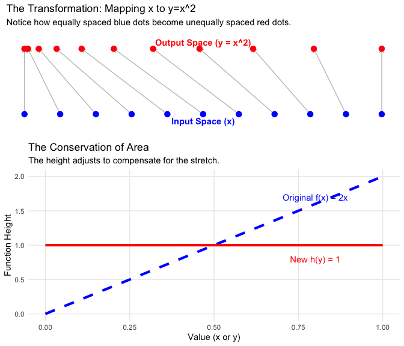
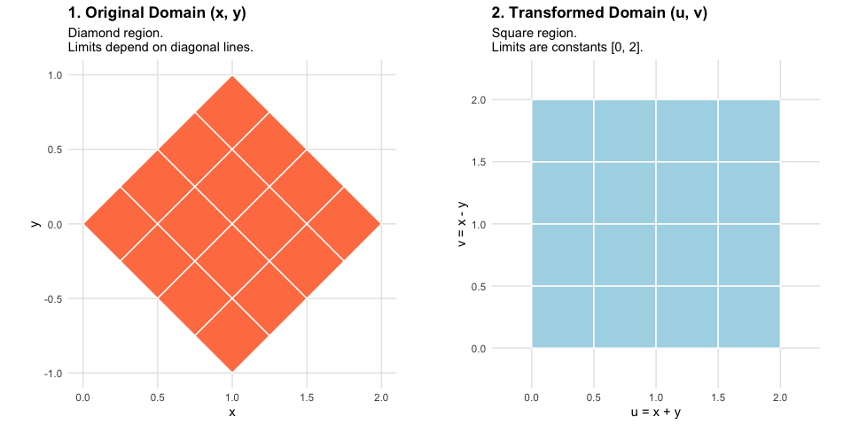

Change of Variables
================
Jibo Shen

Sometimes in calculus and statistics, we need to switch our perspective.
We might have a function defined in terms of $x$, but we realize that a
new variable $y$ (which is a function of $x$, like $x^2$ or $\log x$)
gives us a better view of the problem.

However, simply plugging the new variable into the equation is not
enough. We have to account for how the transformation stretches or
compresses the coordinate system.

## The Univariate Case

**Intuition: Conservation of Area**

Imagine a rectangle of clay sitting on the x-axis.

- Its **Height** is the function value $f(x)$.
- Its **Width** is a tiny interval $dx$.
- The **Area** (mass of the clay) is $f(x) \cdot dx$.

Now, suppose we define a new variable $y$ that stretches the x-axis, for
example, $y = 2x$.

- The “width” of our base has doubled ($dy = 2dx$).
- To keep the **same amount of clay** (conservation of area), the
  “height” of the function must drop by half.

**Correction Factor: The Derivative**

We need a correction factor to adjust the height so that the total area
remains invariant. This factor is the derivative.

$$
\text{New Height} = \text{Old Height} \times \text{Scaling Factor}
$$

Formally, if we switch from $x$ to $y$, the new function $h(y)$ is
related to the old function $f(x)$ by:

$$
h(y) = f(x) \cdot \lvert \frac{dx}{dy} \rvert
$$

- $\frac{dx}{dy}$ measures the rate at which $x$ changes relative to
  $y$.
- If this derivative is less than 1, it means the space was stretched,
  so we shrink the height.
- If this derivative is greater than 1, it means the space was squished,
  so we increase the height.

**Summary of Steps**

To transform a function $f(x)$ into a new function $h(y)$ using the
relationship $y = g(x)$:

1.  **Invert:** Solve the equation $y = g(x)$ for $x$ (express $x$ in
    terms of $y$).
2.  **Differentiate:** Calculate the derivative of $x$ with respect to
    $y$ ($\frac{dx}{dy}$).
3.  **Substitute:** Use the change of variables formula:
    $$h(y) = f(x) \cdot \lvert \frac{dx}{dy} \rvert$$ *(Note: You must
    replace the $x$ inside $f(x)$ with its equivalent expression in
    terms of $y$ so the final result is purely a function of $y$)*.
4.  **Find Support:** Determine the new support of $y$ values by mapping
    the original $x$ interval through the function transformation.

**Example:** Let $f(x) = 2x$ on the interval $[0, 1]$. The total area
is 1. Let’s define a new variable $y = x^2$. How does the function look
in terms of $y$, if we want to keep the area preserved?

1.  **Invert:** $y = x^2\rightarrow$ $x = \sqrt{y}$ as $x$ is in
    $[0,1]$.

2.  **Differentiate:** $\frac{dx}{dy} = \frac{1}{2\sqrt{y}}$.

3.  **Substitute:** $$
    h(y) = f(\sqrt{y}) \cdot \lvert \frac{1}{2\sqrt{y}}\rvert
    $$ $$
    h(y) = (2\sqrt{y}) \cdot \frac{1}{2\sqrt{y}} = 1
    $$

4.  **Find the New Support:** We must also transform the interval where
    the function is defined.

    - Old Support: $0 \le x \le 1$.
    - Transformation: $y = x^2$.
    - New Support:
      - When $x=0, y=0^2=0$.
      - When $x=1, y=1^2=1$.
      - Since $y=x^2$ is increasing on this interval, the new support is
        simply $0 \le y \le 1$.

5.  **Final Result:** $$
    h(y) = \begin{cases} 1 & \text{if } 0 < y < 1 \\ 0 & \text{otherwise} \end{cases}
    $$ The function has transformed from a slope ($2x$) to a flat line
    ($1$), but the total area is preserved.

------------------------------------------------------------------------

## The Bivariate Case and The Jacobian

When we move to two variables (transforming $(x, y)$ to $(u, v)$), the
logic is identical, but the geometry is slightly richer. Instead of
stretching a line segment, we are warping a 2D area.

A small square in the $(u, v)$ plane might be stretched into a diamond,
a rotated rectangle, or a curved wedge in the $(x, y)$ plane. We need a
factor that captures this **Area Distortion**.

**The Jacobian Matrix**

If we have the inverse transformations $x = g(u, v)$ and $y = h(u, v)$,
the **Jacobian Matrix** $J$ collects all the partial derivatives:

$$
J = \begin{bmatrix} \frac{\partial x}{\partial u} & \frac{\partial x}{\partial v} \\ \frac{\partial y}{\partial u} & \frac{\partial y}{\partial v} \end{bmatrix}
$$

The **Determinant** of this matrix, $|\det(J)|$, plays the exact same
role as $|\frac{dx}{dy}|$ did in the univariate case. It tells us the
ratio of areas between the two coordinate systems.

**The Formula**

To represent the function in the new $(u, v)$ coordinates while
maintaining the correct volume integration:

$$
\text{New Function}(u, v) = \text{Old Function}(x, y) \cdot | \det(J) |
$$

**Determinant Formula (2x2 Matrix)**

For a general $2 \times 2$ matrix $A$: $$
A = \begin{pmatrix} 
a & b \\ 
c & d 
\end{pmatrix}
$$

The determinant is calculated as: $$
\det(A) = ad - bc
$$

**Summary of Steps:**

1.  **Invert:** Write $x$ and $y$ in terms of the new variables $u$ and
    $v$.
2.  **Differentiate:** Calculate the four partial derivatives and obtain
    the Jacobian Matrix, $J$.
3.  **Determinant:** Find the determinant of the $J$ ($2 \times 2$
    matrix).
4.  **Substitute:** Multiply the original function by the absolute value
    of this determinant.

### Example: Transforming a Diamond into a Square

Let’s consider the function $f(x, y) = (x + y)^2$ defined over a
“Diamond” region $D$ bounded by the lines:

- $x + y = 0$
- $x + y = 2$
- $x - y = 0$
- $x - y = 2$

We want to represent this function in a new coordinate system $(u, v)$
where the domain is a simple square, rather than a tilted diamond.

**Step 1: Choose new Variables**

We define new variables that align with the boundaries of our region:
$$u = x + y$$ $$v = x - y$$

**Step 2: Determine the New Support**

Substitute our boundary equations into the new variables:

- $x + y = 0 \implies u = 0$
- $x + y = 2 \implies u = 2$
- $x - y = 0 \implies v = 0$
- $x - y = 2 \implies v = 2$

The new region $S$ in the $(u, v)$ plane is now a square: $u \in [0, 2]$
and $v \in [0, 2]$.

**Step 3: Invert the Transformation**

To find the Jacobian, we need $x$ and $y$ in terms of $u$ and $v$.

- Add the equations ($u+v = 2x$) $\rightarrow x = 0.5(u + v)$
- Subtract them ($u-v = 2y$) $\rightarrow y = 0.5(u - v)$

**Step 4: Calculate the Jacobian** $$
J = \begin{bmatrix} \frac{\partial x}{\partial u} & \frac{\partial x}{\partial v} \\ \frac{\partial y}{\partial u} & \frac{\partial y}{\partial v} \end{bmatrix} = \begin{bmatrix} 0.5 & 0.5 \\ 0.5 & -0.5 \end{bmatrix}
$$

$$
|\det(J)| = |(0.5)(-0.5) - (0.5)(0.5)| = |-0.5| = 0.5
$$

This tells us that area in the $(x, y)$ plane is half the size of the
corresponding area in the $(u, v)$ plane.

*Note on Area:* The Diamond (Area = 2) is mapped to the Square (Area =
4). This expansion is why our Jacobian correction factor is $0.5$ (we
need to shrink the result back down).

**Step 5: The Final Representation**

We can now write the full representation of the function in the new
variables.

- **Original Function:** $(x+y)^2$ becomes $u^2$.
- **Correction Factor:** $0.5$.

$$
g(u, v) = u^2 \cdot 0.5 \quad \text{for } 0 \le u \le 2, \ 0 \le v \le 2
$$

We have successfully transformed a diamond region problem into a simple
square region problem.

Note: Try to integrate $f(x,y)$ and $g(u,v)$ over $\mathbb{R}^2$, and
see if they are equal. The integration of $f(x,y)$ is a bit challenging,
but is a good practice.
